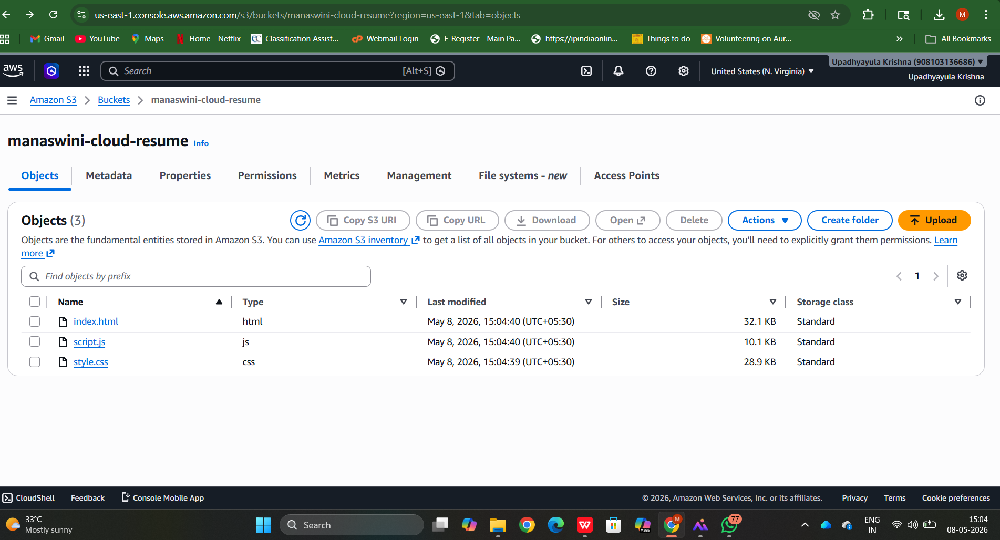
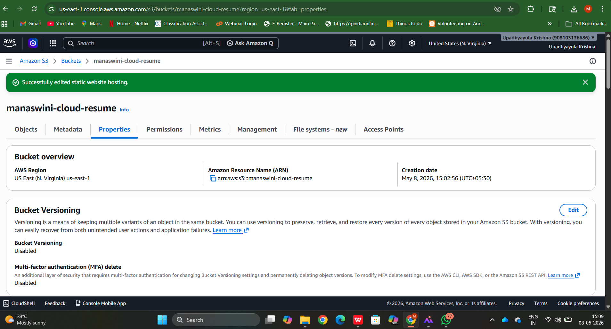
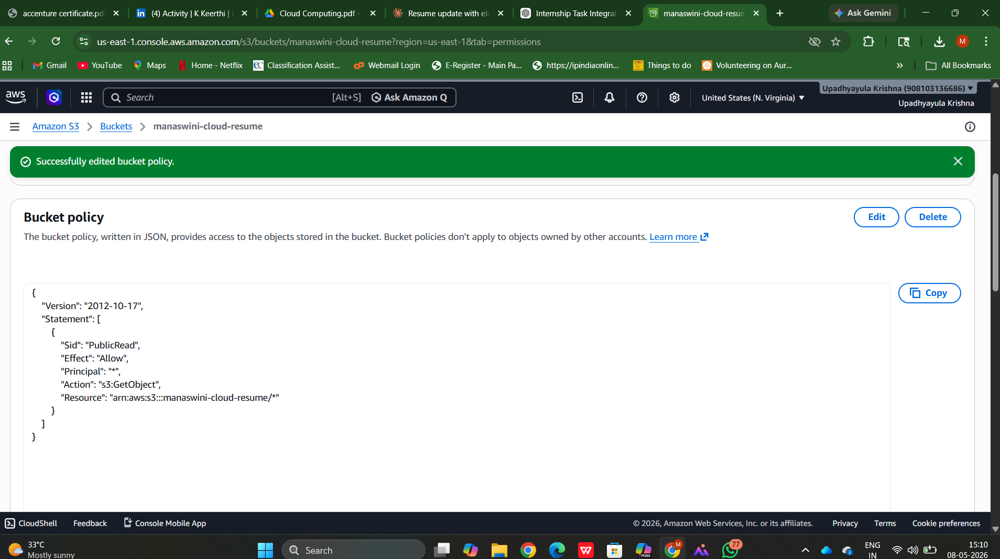
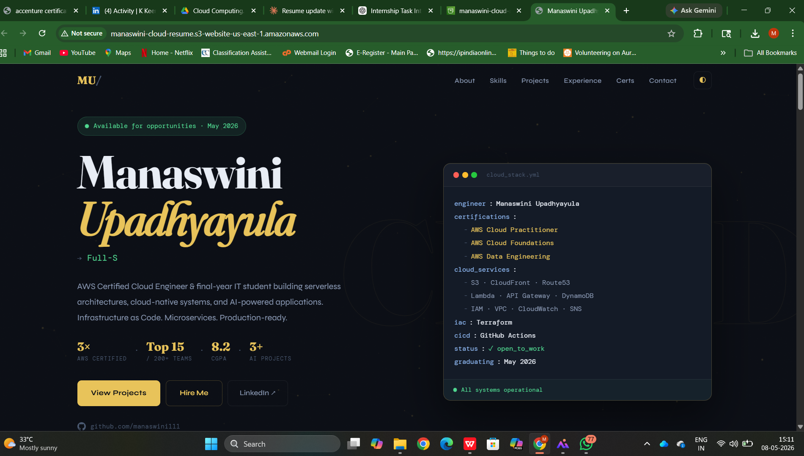

# Task 1: Cloud Storage Setup (AWS S3)

## Objective
To create and configure cloud storage using AWS S3 and host a static website.

## Steps Performed
1. Created an S3 bucket
2. Uploaded website files (HTML, CSS, JS)
3. Enabled static website hosting
4. Configured public access using bucket policy

## Tools Used
- AWS S3

## Output
Successfully hosted a static website using AWS S3.

## Screenshots

### 1. S3 Bucket Created

### 2. Files Uploaded

### 3. Static Website Hosting Enabled

### 4. Bucket Policy

### 5. Live Website Output
![Website] (http://manaswini-cloud-resume.s3-website-us-east-1.amazonaws.com/)