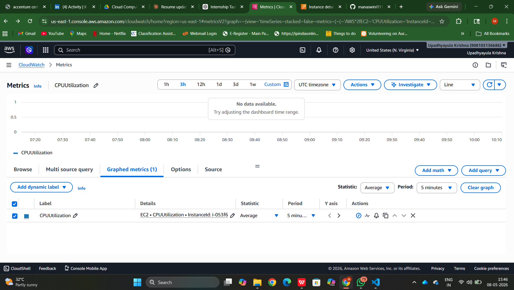
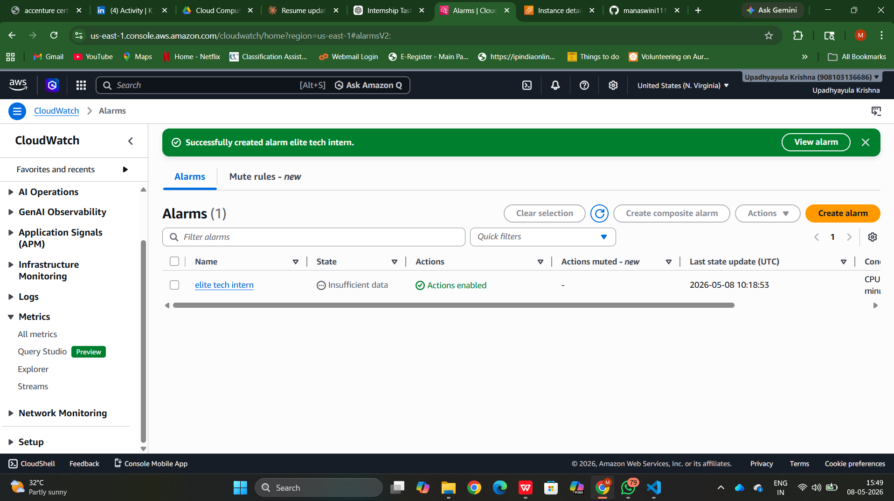

# Task 2: Cloud Monitoring and Alerts

## Objective
To monitor cloud resources and set up alerts using AWS CloudWatch.

## Steps Performed
1. Created an EC2 instance
2. Monitored CPUUtilization metric in CloudWatch
3. Created an alarm with threshold condition
4. Configured email notification using SNS

## Tools Used
- AWS CloudWatch
- EC2
- Amazon SNS

## Output
Successfully created monitoring graph and alert system.

## Screenshots

### 1. Metrics Graph (CPUUtilization)

### 2. Alarm Created

