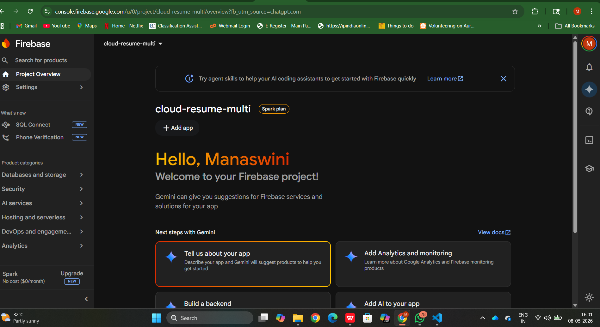
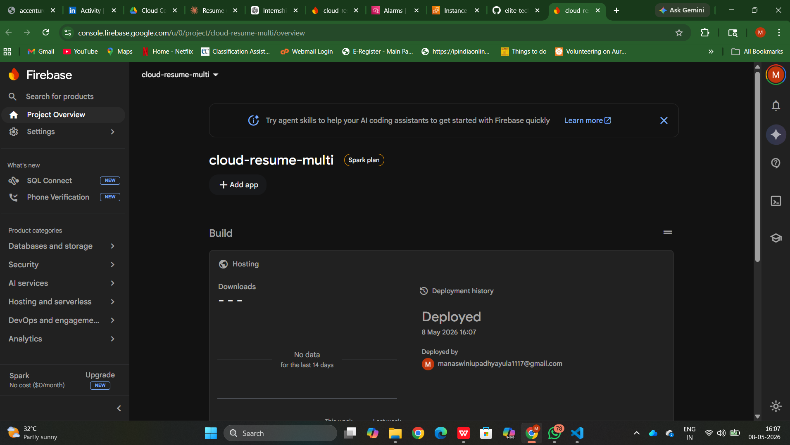

# Task 3: Multi-Cloud Architecture

## Objective
To design a system using multiple cloud providers.

## Cloud Providers Used
- AWS S3
- Firebase Hosting

## Architecture
User → Firebase Hosting → AWS S3

## Steps Performed
1. Hosted website using Firebase
2. Used AWS S3 for storage
3. Connected both services

## Output
Successfully deployed a multi-cloud architecture.

## Live Website
[Click here](https://console.firebase.google.com/u/0/project/cloud-resume-multi/overview)

## Screenshots

### Firebase Hosting

### Architecture Diagram
