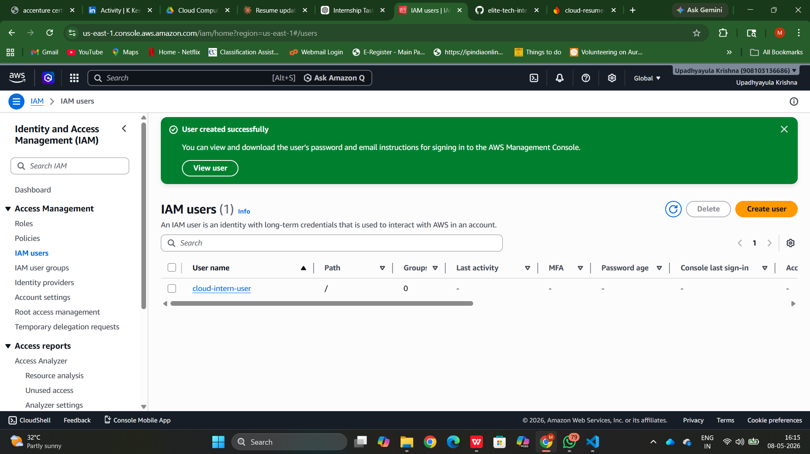
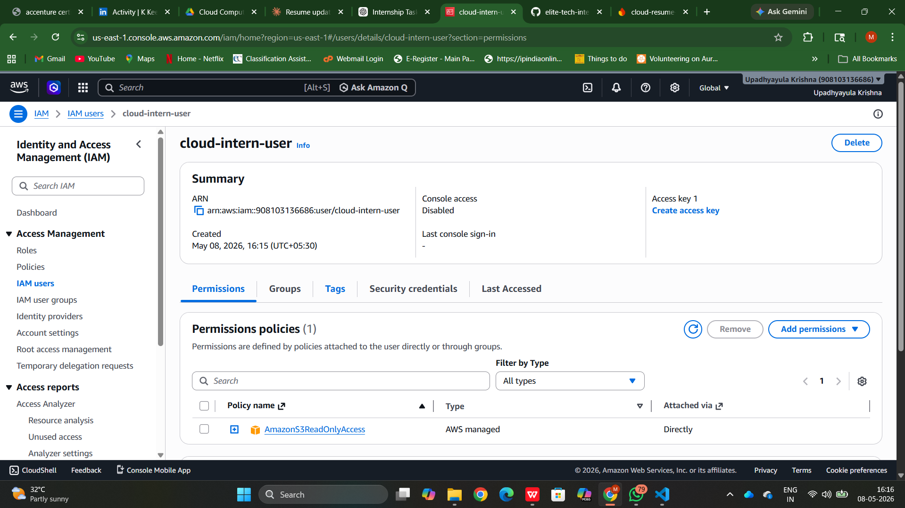
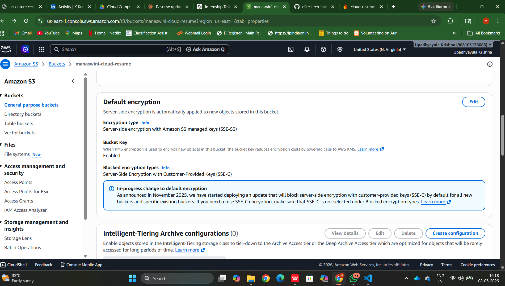

# Task 4: Cloud Security Implementation

## Objective
To implement security features in cloud services using AWS.

## Steps Performed
1. Created IAM user
2. Assigned S3 read-only policy
3. Enabled encryption for S3 bucket
4. Configured secure access

## Tools Used
- AWS IAM
- AWS S3

## Output
Successfully implemented security practices in cloud environment.

## Screenshots

### IAM User Created

### Permissions Policy

### S3 Encryption Enabled
